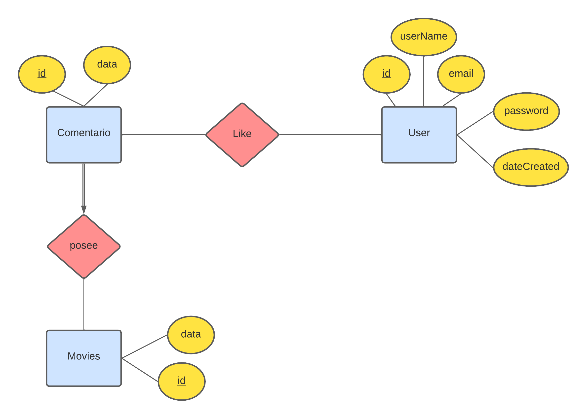

# HORRORPEDIA

## INTEGRANTES
|Nombre y Apellido|Código|Roles|
|:---|:---|:---|
|Angel Mora Huamanchay|202010031|Backend|
|Angel Gabriel Mucha Huaman|202110706|Frontend|
|Johan Fabian Callinapa Chunga|202110701|Frontend|

## DESCRIPCIÓN DEL PROYECTO

Nuestro proyecto es una página web que contiene una lista de películas de terror con su respectiva información:
* **Título de la película**
* **Poster de la película**
* **Fecha de estreno de la película**
* **Descripción de la película**

Donde los usuarios van a poder ver los comentarios realizados por otros usuarios sobre aquellas películas y también podrán comentar sobre ellas, pero no solo eso, también podrán dar una calificación a la película y un me gusta al comentario.

Para mostrar los comentarios tendremos en cuenta la cantidad de me gusta de cada uno para así ordenarlo de forma descendente mostrando los comentarios que poseen una mayor cantidad de me gusta al comienzo. 

Solamente los usuarios registrados pueden comentar y dar me gusta por lo cuál hemos implementado una autenticación usando varias función provenientes de ***FLASK*** para poder manejar la sesión de un usuario, y también para poder encriptar la contraseña del usuario al momento que se registrar y poder validarla al momento que inicia sesión. 

## MISIÓN
Nuestra misión es proveer a nuestros usuarios, amantes de las películas de terror, un espacio donde puedan encontrar películas tanto recién estrenadas o antiguas con su respectiva información, así como también los comentarios y opiniones acerca de ellas para así facilitarle la elección de alguna película para su noche de cine. 
## VISIÓN
Nuestra visión es convertirnos en una de las mejores páginas web de películas de terror en el Perú y también en Latinoamérica.

## LIBRERÍAS UTILIZADAS
Las librerías utilizadas en el proyecto son:
* **Flask:** Es un “micro” Framework escrito en Python y concebido para facilitar el desarrollo de Aplicaciones Web.
* **SQLAlchemy:** Es el kit de herramientas SQL de Python y Object Relational Mapper que brinda a los desarrolladores de aplicaciones toda la potencia y flexibilidad de SQL.
* **psycopg2:** Es el adaptador de base de datos PostgreSQL más popular para el lenguaje de programación Python.
* **python-dotenv:** Lee pares clave-valor de un archivo y puede establecerlos como variables de entorno.
* **Werkzeug:** Es una completa biblioteca de aplicaciones web WSGI. Comenzó como una simple colección de varias utilidades para aplicaciones WSGI y se ha convertido en una de las bibliotecas de utilidades WSGI más avanzadas.
* **Flask-Migrate:** Es una extensión que maneja las migraciones de bases de datos SQLAlchemy para aplicaciones Flask que usan Alembic.
* **http-tools:** httptools lo ayuda a capturar, repetir e interceptar en vivo las solicitudes HTTP con capacidades de secuencias de comandos.

# Información acerca de los endpoint
* En el archivo home.py se encuentran los siguientes endpoints: 
  * **home:** Es la encargada de renderizar la página principal de nuestro proyecto y de validar si el usuario esta logueado.
  * **infoMovie:** Es la encargada de realizar la lógica para obtener la información de la pelicula seleccionada y renderizar la página con aquella información.
  
* En el archivo users.py se encuentran los siguientes endpoints:
  * **login:** Este endpoint es el encargado de renderizar la página de inicio de sesión y de realizar la lógica de validación del email y la contraseña. Si la validación es exitosa se agrega a la sesión de la aplicación la información del usuario logueado, de lo contrario se envía los mensajes correspondientes de error.
  * **register:** Este endpoint es el encargado de renderizar la página de registro de usuario y de realizar la validación del username, email y contraseña para que el usuario pueda registrarse de manera exitosa en la página web.
  * **logout:** Este endpoint es el encargado de realizar la lógica de cierre de sesión del usuario en la página web.

* En el archivo movies.py se encuentran los siguientes endpoints:
  * **getMovies:** Es el encargado de obtener la lista de películas de terror guardadas en la base de datos.
  * **getMoviesById:** Es el encargado de obtener y mandar toda la información de la película seleccionada, através de su id, al cliente.
  * **createMovie:** Este endpoint es el encargado de crear y agregar una película en la base de datos.
  * **agregarmoviesJSON:** En este endpoint se encuentra la lógica para agregar un conjunto de peliculas que se encuentren en el archivo movies.json a la base de datos.
  * **updateMovie:** Este endpoint es el encargado de actualizar la información, especialmente la calificación de la película en la base de datos.
  * **deleteMovie:** Este endpoint es el encargado de eliminar una película através de su id en la base de datos.
  
* En el archivo comentario.py se encuentran los siguientes endpoints:
  * **getComentario:** Este endpoint recibe como parametro el id de la película y retorna la información de la lista de comentarios que se hicieron a aquella película, además de agregarle la cantidad de likes que posee y ordenarla de forma descendente por la cantidad de likes.
  * **createComentario:** Este endpoint es el encargado de crear y agregar un comentario realizado por el usuario en la base de datos.
  * **updateComentario:** Este endpoint es el encargado de actualizar la información de un comentario, especialmente la cantidad de likes en la base de datos.
  * **deleteComentario:** Este endpoint es el encargado de eliminar un comentario através de su id en la base de datos.

* En el archivo likes.py se encuentran los siguientes endpoints:
  * **addLike:** Este endpoint recibe como parámetros el *id del comentario* y el *id del usuario*, se encarga de agregar un like realizado por el usuario al comentario.
  * **deleteLikes:** Este endpoint recibe como parámetros el *id del comentario* y el *id del usuario*, se encarga de eliminar un like através de su id y además validar que solo usuario que creo ese comentario pueda ejecutar dicha acción.

###
## Modelos de la base de datos
* **COMENTARIO:**
  * **Atributos:**
    * **id:** Es el identificador de la tabla de tipo entero, además es el primary key.
    * **data:** Es donde se encuentra toda la información necesaria del comentario, es de tipo JSON.

* **MOVIES:**
  * **Atributos:**
    * **id:** Es el identificador de la tabla de tipo entero, además es el primary key.
    * **data:** Es donde se encuentra toda la información necesaria de la película, es de tipo JSON.
* **USER:**
  * **Atributos:**
    * **id:** Es el identificador de la tabla de tipo entero, además es el primary key.
    * **userName:** Es el nombre del usuario de tipo STRING.
    * **email:** Es el correo electrónico del usuario de tipo STRING.
    * **password:** Es la contraseña del usuario de tipo STRING que al momento de registrarse es encriptada.
    * **dateCreated:** Es la fecha en la que se creó el usuario de tipo DATETIME.
* **LIKE_USER_COMENTARIO:** Es la relación many to many entre el usuario y el comentario, esta relación se crea cuando un usuario le da like a un comentario.

# Hosts
* El **proyecto** se encuentra en **localhost:5000**, host proporcionado por ***FLASK.***

* Nuestra **base de datos** se encuentra en **ec2-54-164-40-66.compute-1.amazonaws.com**. El motivo por el cuál subimos nuestra base de datos a un host remoto es por la facilidad al momento de diseñar el front-end de nuestra página web, ya que si hubiesemos dejado nuestra base de datos en el local al momento que un integrante desee ver los datos tendría que agregarlos el mismo a su base de datos local, obviamente este proceso no es el adecuado por lo cuál como grupo tomamos la decisión de subir nuestra base de datos a un host remoto proveido por **Heroku**.

## FORMA DE AUTENTICACIÓN
* No es necesario registrarse o inciar sesión para poder acceder a nuestra página web, pero como se mencionó anteriormente el usuario debe de estar registrado y logueado en la página web para poder hacer un comentario o darle me gusta. Para eso hemos implementado un sistema de autenticación usando las funciones Werkzeug y session provenientes de Flask. 
  * La primera la usamos al momento de registrar un usuario para encriptar la contraseña ingresada y al momento de iniciar sesión para poder verificar que la contraseña ingresada sea la misma del usuario
  * la segunda la usamos para poder guardar la información del usuario logueado en la sesión haciendo que aquella información sea accesible en cualquier parte de la página.
* Al momento de iniciar sesión se le redirige a la página **login.html**, donde se encuentra los inputs necesarios para que el usuario pueda loguearse.
* Al momento de registrarse se le redirige a la página **register.html**, donde se encuentra los inputs necesarios para que el usuario pueda registrarse.

## Manejo de errores HTTP
* Para el manejo de errores hemos utilizado la libreria **http-tools**, la cual nos permite manejar los errores HTTP de forma sencilla y eficiente.
* Usamos la función **abort** para manejar los errores HTTP, esta función recibe como parámetro el código de error proveniente de **http-tools**.
* Para nuestro proyecto usamos los siguientes códigos de error:
  * **INTERNAL_SERVER_ERROR: 500**: Error interno del servidor.
  * **ACEPTED: 202**: El recurso ha sido aceptado.
  * **NOT_FOUND: 404**: El recurso solicitado no existe.
  
## Cómo ejecutar el sistema (Deployment scripts)
* Es necesario crearse un entorno virtual, el comando es:
  * **python -m venv nombre_del_entorno_virtual**
* En el entorno virtual se debe de ejecutar el siguiente comando:
  * **./nombre_del_entorno_virtual/Scripts/activate**
* Una vez activado el entorno virtual se debe de ejecutar el siguiente comando:
  * **pip install -r requirements.txt**
  * con esto se instala todas las librerías necesarias para que corra la página web.
* Para correr el sistema en el host local, se debe de ejecutar el siguiente comando:
  * **python app.py**
